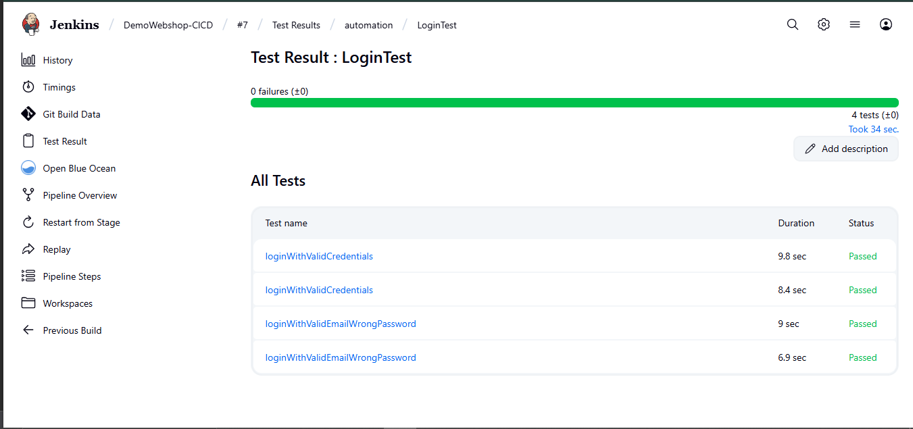
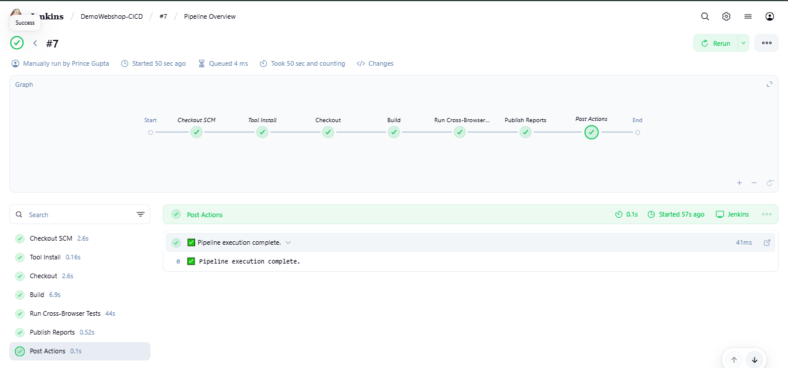
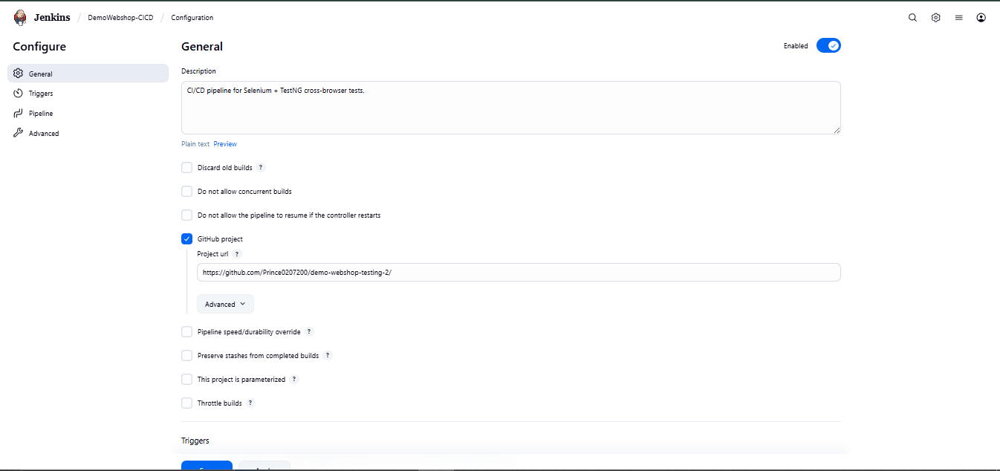
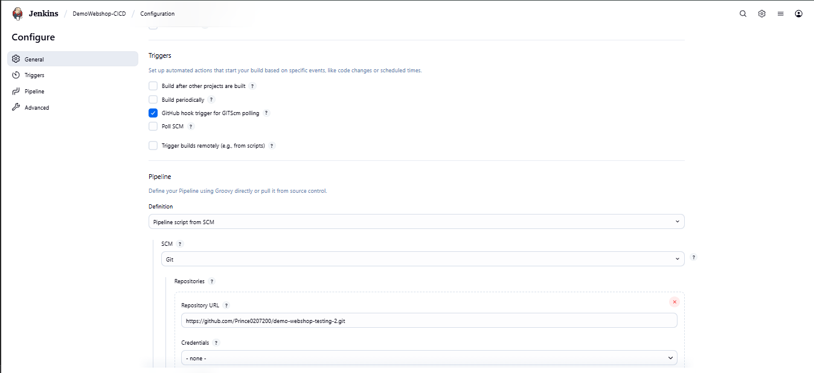
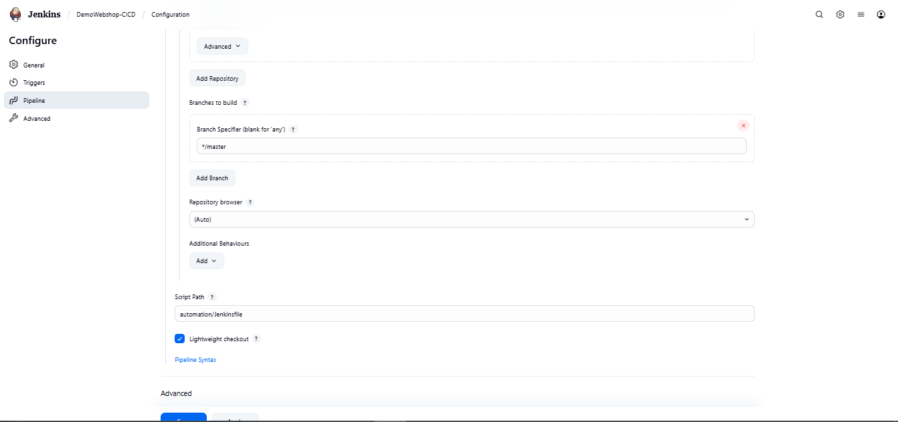

# DemoWebshop Automated Testing with Jenkins CI/CD

## Project Overview
This project automates testing for the **DemoWebshop** application using **Selenium WebDriver** integrated with a **Jenkins CI/CD pipeline**. The goal is to enable continuous testing to ensure code quality and receive rapid feedback during development.

---

## Table of Contents
- [Prerequisites](#prerequisites)
- [Setup Instructions](#setup-instructions)
- [How to Run](#how-to-run)
- [Jenkins Pipeline Details](#jenkins-pipeline-details)
- [Jenkins Console Output](#jenkins-console-output)
- [Test Results](#test-results)
- [Known Issues & Resolutions](#known-issues--resolutions)
- [Conclusion](#conclusion)
- [Screenshots](#screenshots)
- [Accessing Jenkins](#accessing-jenkins)
- [Contact](#contact)

---

## Prerequisites
✅ This section lists the tools you need before running the project:

- Java JDK 8 or higher  
- Maven installed  
- Jenkins installed and running (tested on `localhost:8080`)  
- Selenium WebDriver dependencies configured  
- DemoWebshop application accessible  

---

## Setup Instructions

⚙️ Follow these steps to set up the project locally or on Jenkins:

1. **Clone the repository:**
    ```bash
    git clone https://github.com/yourusername/demo-webshop-automation.git
    cd automation
    ```
    *Alternatively: You can manually import this project into Eclipse as a Maven project.*

2. **Install dependencies:**
    ```bash
    mvn clean install
    ```

3. **Configure Jenkins:**
    - Create a new Jenkins job (Freestyle or Pipeline)
    - Connect it to your GitHub repository
    - Set build triggers (e.g., GitHub webhook)
    - Add a build step to run tests:
      ```bash
      mvn test
      ```
    - Configure post-build actions to publish test reports

---

## How to Run

▶️ You can run the test suite in two ways:

### Locally via Maven:
```bash
mvn test

```
    
- Via Jenkins(Recommended):
    - Trigger build manually or by commit webhook
    - Jenkins will execute tests and publish reports

---

## Jenkins Pipeline Details
- Jenkins URL: `http://localhost:8080`  
- Job Name: `DemoWebshop-CICD`  
- Pipeline includes:
    - Pulling latest code from GitHub
    - Running Selenium tests
    - Publishing test results and console output

---

[View Console Output (Text File)](../images/consolelog-output.txt)
<details>
<summary>🔧 Click to view sample Jenkins console output</summary>
Started by user Prince Gupta
Obtained Jenkinsfile from Git
Running on Jenkins node
🔧 Compiling the code...
🚀 Running TestNG in parallel on Chrome & Edge...

[INFO] Running TestSuite
[INFO] Tests run: 4, Failures: 0, Errors: 0, Skipped: 0
✅ Pipeline execution complete.
Finished: SUCCESS

</details>


---

## Test Results
- Total tests run: 4
- Passed: 4  
- Failed: 0  
- Test reports are published inside Jenkins under the "Test Results" section.  

**Test Report Screenshot:**  


---

## Known Issues & Resolutions
- Issue: Occasional test failure due to element timing delays  
- Resolution: Added explicit waits and retries to stabilize tests  

---

## Conclusion
The automation framework integrated with Jenkins ensures continuous testing of DemoWebshop, significantly reducing manual testing effort and providing fast feedback on code quality. This setup promotes efficient CI/CD practices and higher software reliability.

---

## Screenshots

| Description             | Screenshot                                  |
|------------------------|--------------------------------------------|
| Pipeline Output    |         |
| Test Results Report       |    |
| Jenkins Job Configuration (General) |  |
| Jenkins Job Configuration (Trigger/Pipeline) |  |
| Jenkins Job Configuration (Pipeline) |  |

---

## Accessing Jenkins
Since the Jenkins server is running locally at `http://localhost:8080`, remote access is not available. Screenshots and console logs are provided above to demonstrate the successful build and test execution.

---

## Contact
For questions about this project, please contact:  
**Prince Gupta**  
Email: princegupta1455@gmail.com  

---

*End of README*
